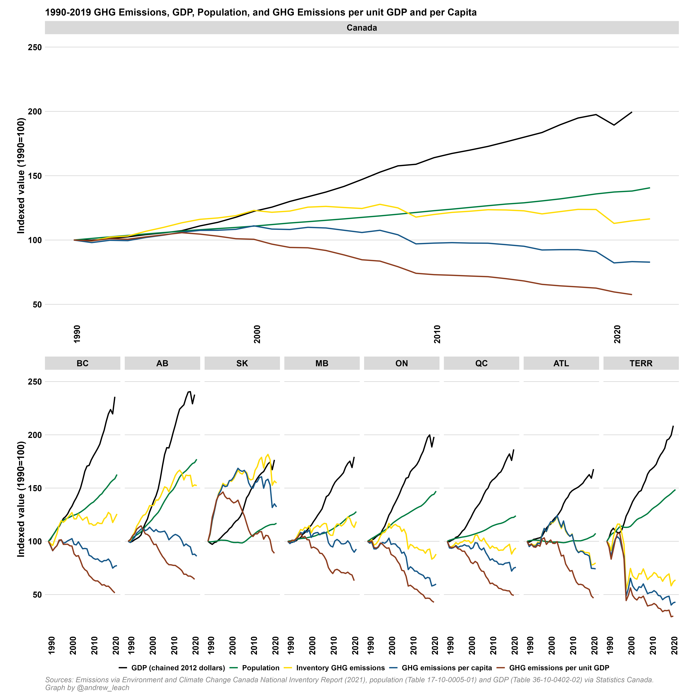

## Canada's National Inventory Report

Each year, Canada and all other signatories to the United Nations Framework Convention on Climate Change submit [annual National Inventory Reports (NIRs)](https://unfccc.int/ghg-inventories-annex-i-parties/2021) which track annual GHG emissions within their countries.

I'm frequently asked for copies of some of the graphs I make for Canada's submissions, so I am in the process of adding them all here, and you are free to use them under the Creative Commons License Conditions.

