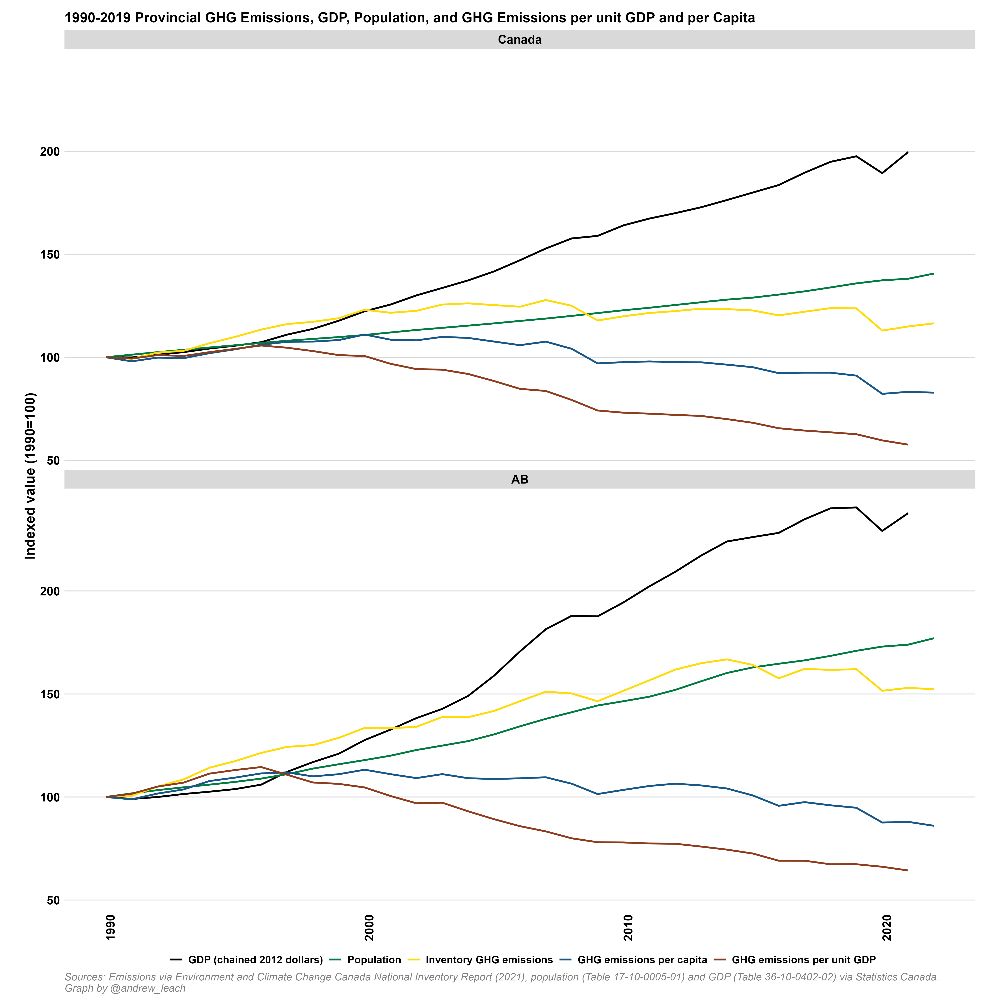
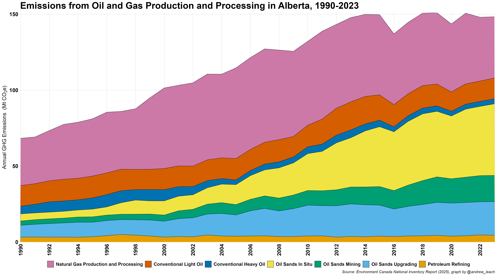

Alberta's emissions place its economy on a collision course with Canada's emissions targets. Things are getting better, but a combination of a faster-growing and more-emissions-intensive economy has seen Alberta's emissions grow much more rapidly than the national average:

And, oil and gas, which is so important to Alberta's economy:

