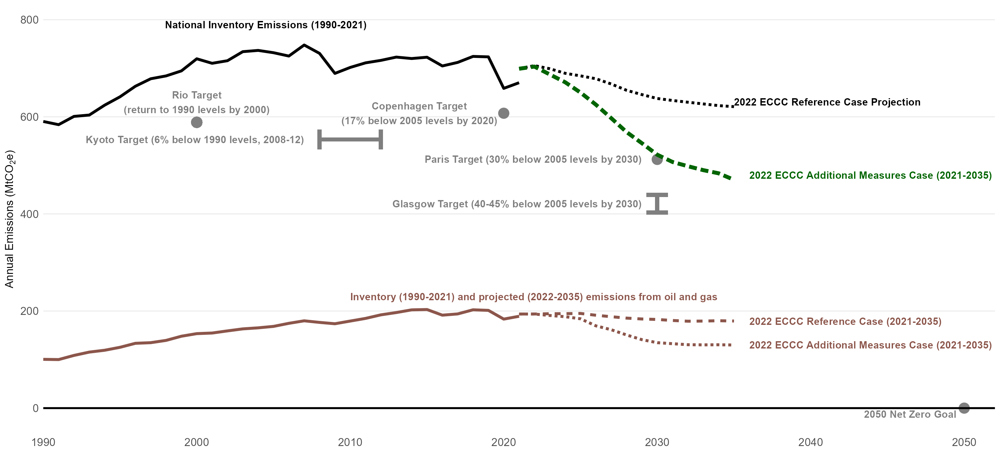

Alberta's emissions place its economy on a collision course with Canada's emissions targets. Things are getting better, but a combination of a faster-growing and more-emissions-intensive economy has seen Alberta's emissions grow much more rapidly than the national average:

And, oil and gas, so important to Alberta's economy, is still projected to grow in a way that will soon be incompatible with Canada's long-term targets.

