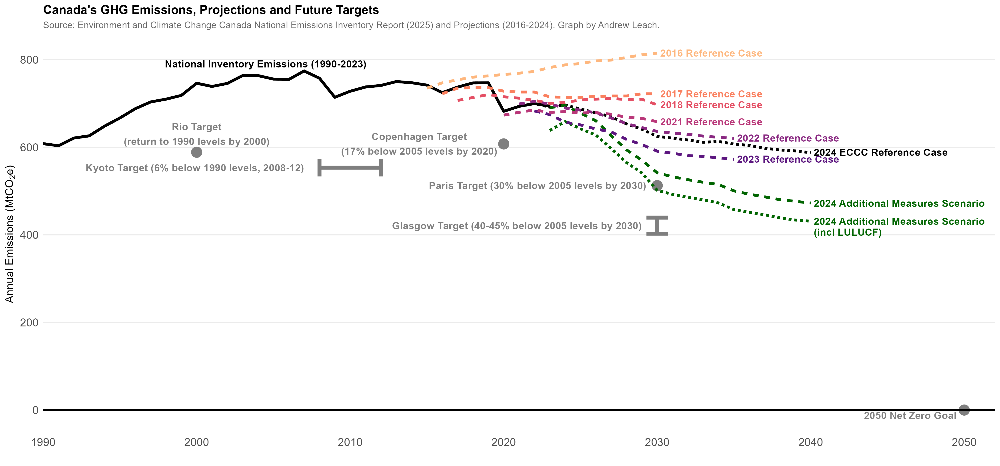
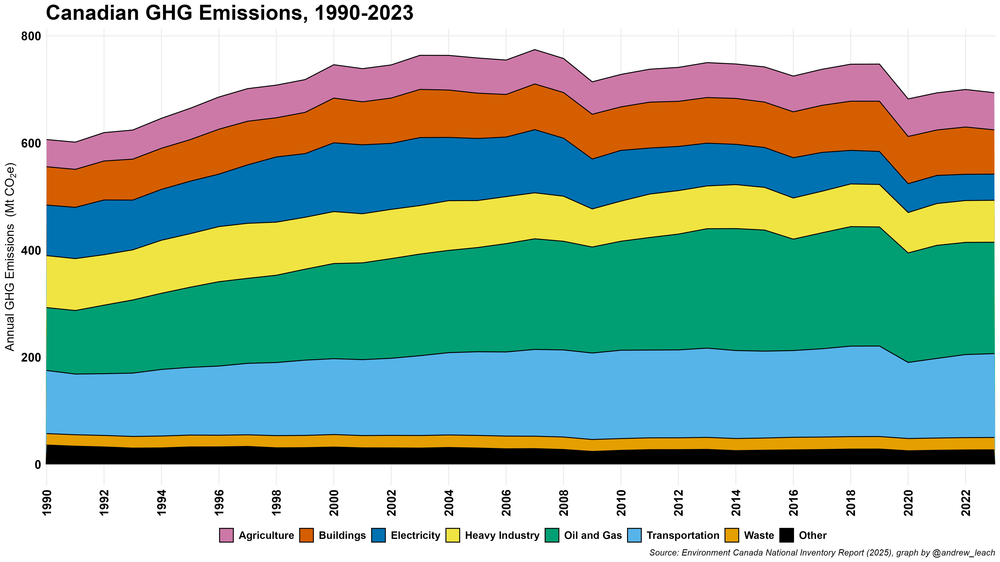
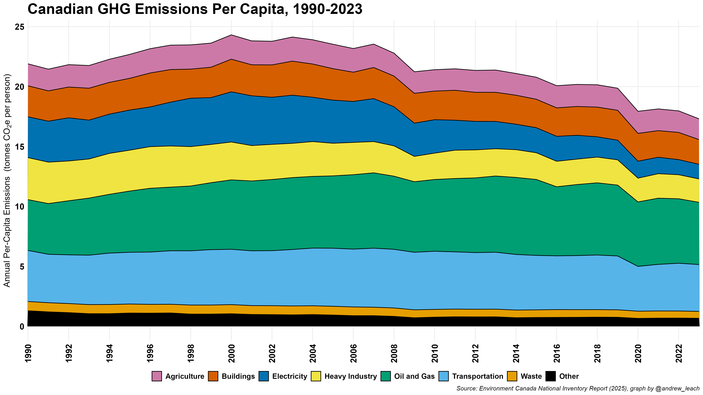

Canada has a long road ahead, especially with the new Glasgow target to reduce emissions to 40-45% below 2005 levels by 2030.

Here's how our national emissions break down by sector:

and how our national emissions per capita look with a similar division by sector:

