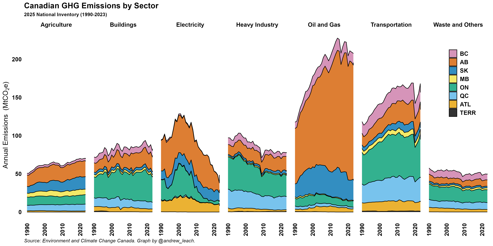
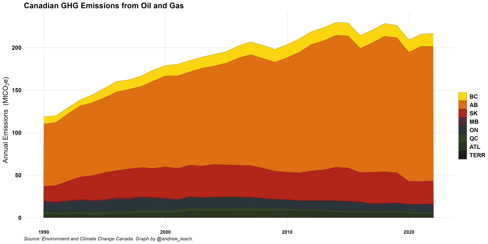
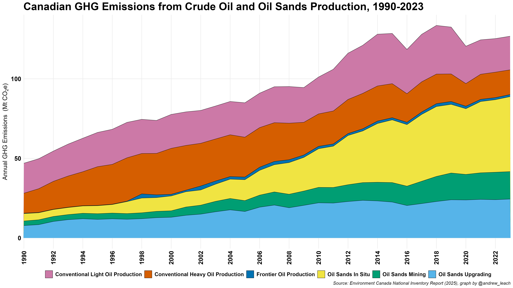
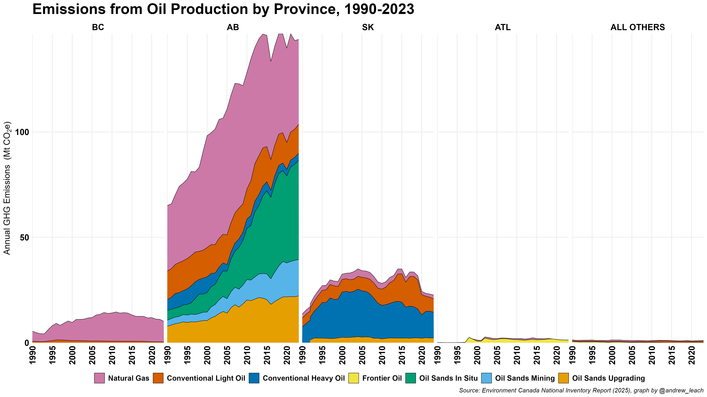
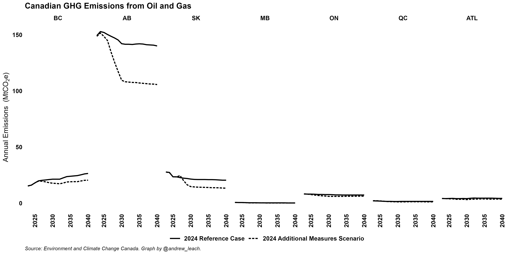

Slicing Canada's emissions inventory by economic sector and province shows a surprising picture in some ways, but also captures where our policy focus really needs to be if we're going to materially reduce emissions: oil and gas and transportation.

Adding projections from ECCC shows where we expect emissions trends to take us:

And, the oil and gas sector, which gets the most attention for its emissions, is isolated in the image below:

With the federal government looking to cap oil and gas emissions, a couple of other graphics might be interesting to people, so I've added them below:

