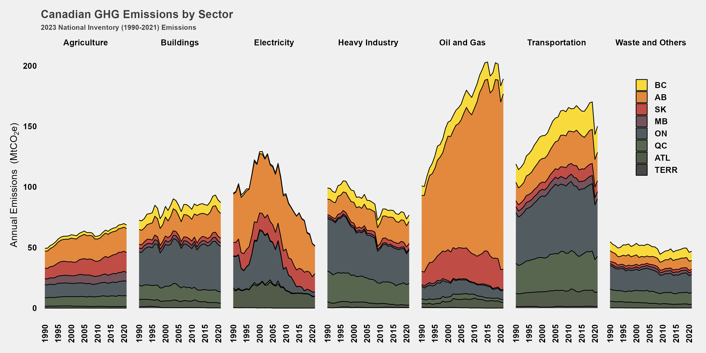

## Canada's National Inventory Report

Each year, Canada and all other signatories to the United Nations Framework Convention on Climate Change submit [annual National Inventory Reports (NIRs)](https://unfccc.int/ghg-inventories-annex-i-parties/2021) which track annual GHG emissions within their countries.

These graphs utilize Canada's emissions inventory, combined with emissions projections from Environment and Climate Change Canada, to help frame both our emissions past and future.

Canada has a long road ahead, especially with the new Glasgow target.

Canada's emissions inventory by province shows where emissions have increased and why different provinces may feel more of a threat from climate change policies.

Slicing canada's emissions inventory by econmomic sector and province shows a surprising picture in some ways, but also captures where our policy focus really needs to be: oil and gas and transportation.

Canada's emissions inventory by IPCC sector and province reveals some other information about point vs non-point sources and, in this case, the small role of things like aviation.

