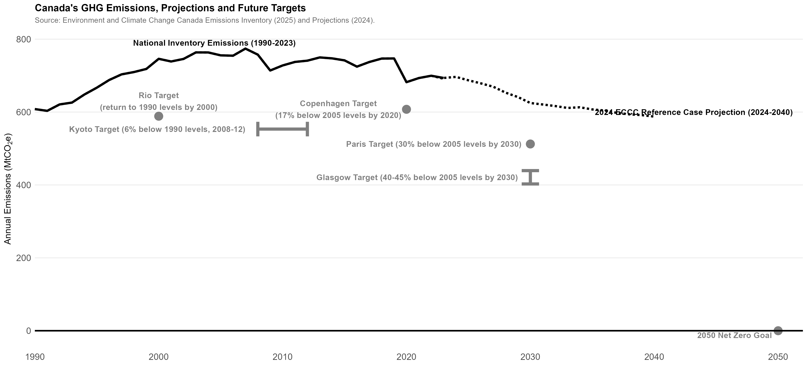

## Canada's National Inventory Report

Each year, Canada and all other signatories to the United Nations Framework Convention on Climate Change submit [annual National Inventory Reports (NIRs)](https://unfccc.int/ghg-inventories-annex-i-parties/2021) which track annual GHG emissions within their countries.

These graphs utilize [Canada's emissions inventory](https://www.canada.ca/en/environment-climate-change/services/climate-change/greenhouse-gas-emissions/inventory.html), combined with [emissions projections](https://www.canada.ca/en/environment-climate-change/services/climate-change/greenhouse-gas-emissions/projections.html) from Environment and Climate Change Canada, to help frame both our emissions past and future.

Canada has a long road ahead, especially with the new Glasgow target to reduce emissions to 40-45% below 2005 levels by 2030.

Canada's emissions inventory by province shows where emissions have increased and why different provinces may feel more of a threat from climate change policies.

Slicing Canada's emissions inventory by economic sector and province shows a surprising picture in some ways, but also captures where our policy focus really needs to be if we're going to materially reduce emissions: oil and gas and transportation.

Canada's emissions inventory by province shown on a per-capita basis is particularly striking.

