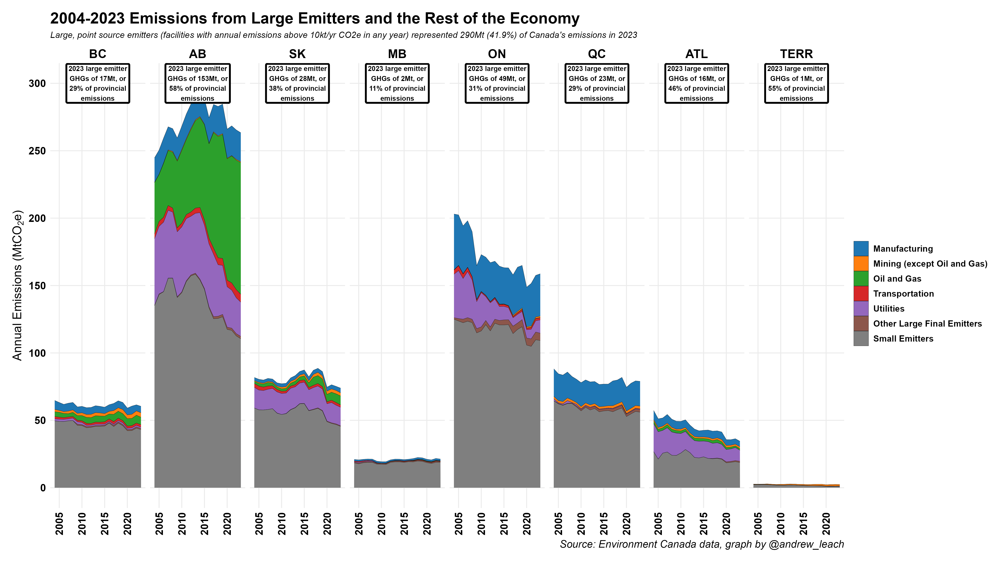

Industrial emissions are important in Canada's inventory. Here's how industrial emissions from large facilities compare to emissions from smaller facilities.

And here are the same data, but with rates of change over time:

