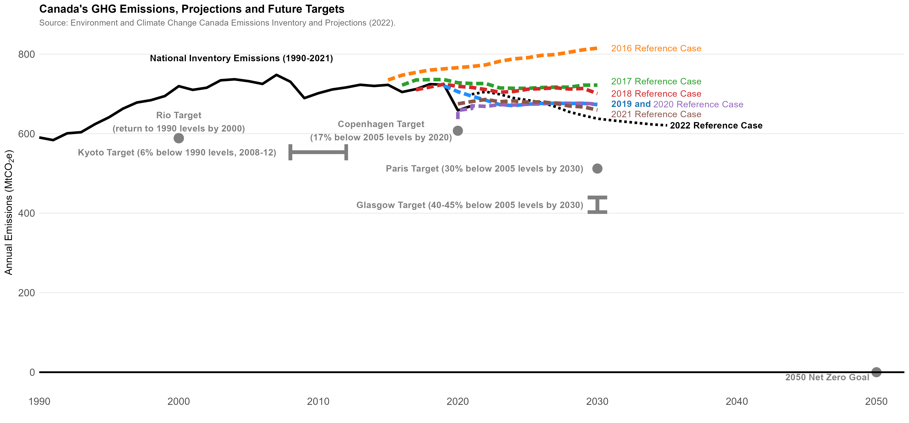

## Canada's Emissions Projections

At irregular intervals, [emissions projections](https://www.canada.ca/en/environment-climate-change/services/climate-change/greenhouse-gas-emissions/projections.html) are released by Environment and Climate Change Canada. I've used some of these projecitons at the national level to show our progress to date, and how far we still have to go to bend the curve.

We can also combine the inventory data with projections to give a sense of where our emissions are expected to come from, here by sector and province:

and here are the same data, arrayed by sector with colors for each province or region:

