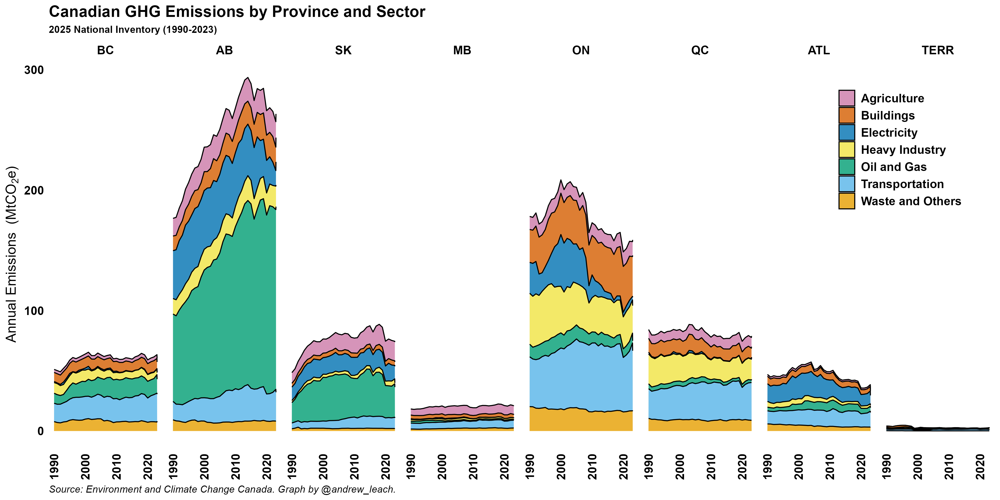
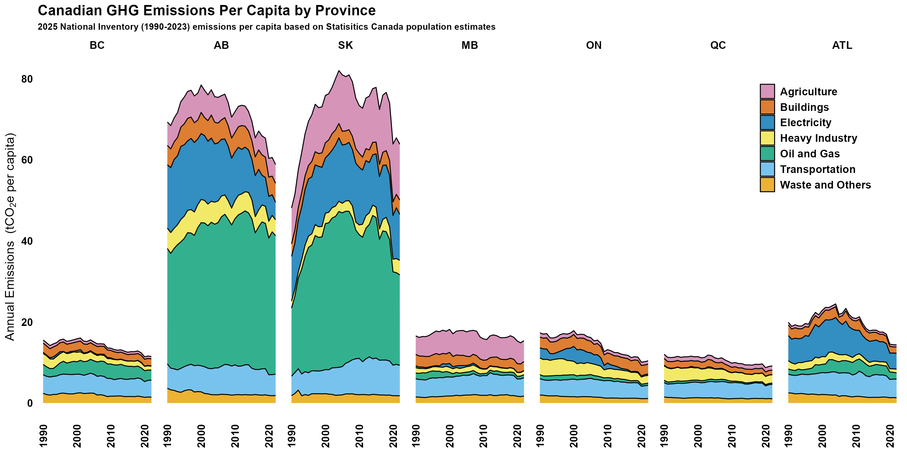
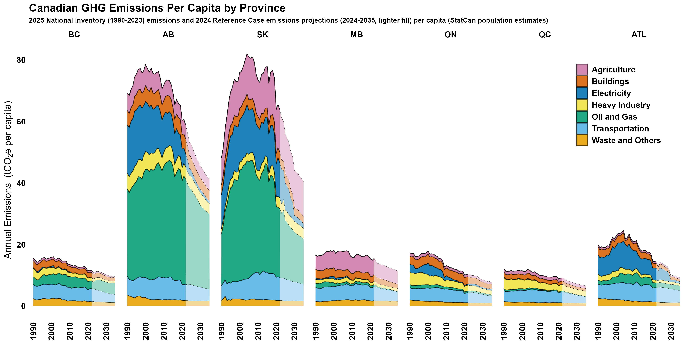

Slicing Canada's emissions inventory by economic sector and province shows a surprising picture in some ways, but also captures where our policy focus really needs to be if we're going to materially reduce emissions: oil and gas and transportation.

and the same data augmented with current reference case projections.

And, the same graphs on a per-capita basis:

and the same data augmented with current reference case projections.

Electricity is also a major differentiator between provinces in Canada:

